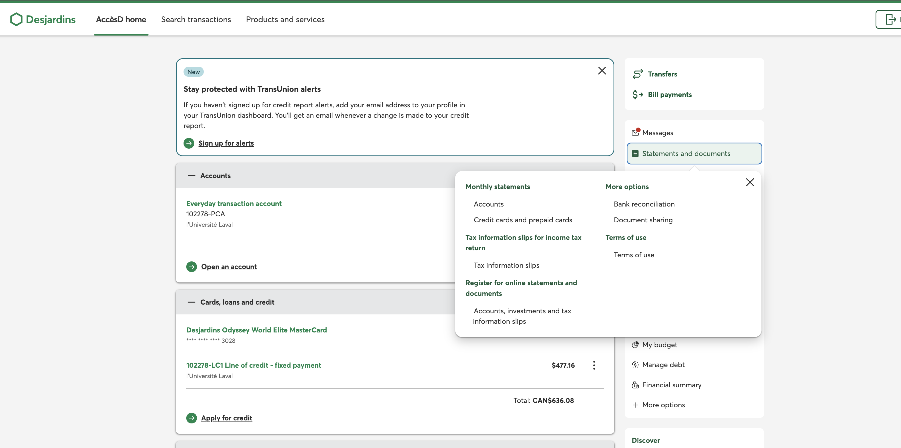
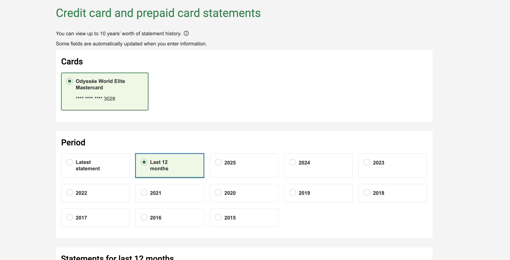
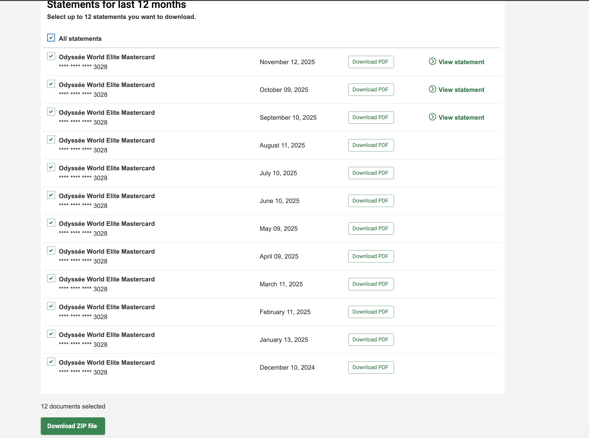

# Desjardins PDF Extractor & Analyzer

This repo extracts transactions from Desjardins credit-card PDF statements and builds interactive spending visuals.

## Download last 12 months of statements
1) Log in to AccèsD. On the right rail, click **Statements and documents**.  
2) In the dropdown, choose **Credit cards and prepaid cards** under **Monthly statements**.  
   
3) On the statements page, select your card and choose **Last 12 months**.  
   
4) Check all statements and click **Download ZIP file**. Unzip the PDFs into `releves/`.  
   

## Setup (macOS)
1) Ensure Python 3.10+ is installed: `python3 --version` (install via Homebrew if needed: `brew install python`).
2) From the repo root, create/activate a virtual environment:
   ```bash
   python3 -m venv .venv
   source .venv/bin/activate
   ```
3) Install dependencies:
   ```bash
   pip install -r requirements.txt
   # if pytest is not in your global pip cache:
   pip install pytest
   ```

## Extract transactions to CSV
Place your PDFs in `releves/`, then run:
```bash
./main.py -i releves -o transactions.csv
# optional:
#   -v          verbose parse stats
#   -g 'pattern.pdf'  only files matching glob (e.g., -g '*-2025.pdf')
```

## Generate interactive graphs
```bash
./analyse.py -i transactions.csv -o html
```
Open the HTML files in `html/`:
- `monthly_spending.html`
- `daily_spending.html`
- `amount_histogram.html`
- `top_merchants.html`

Interactions:
- Click bars/points to see the contributing transactions.
- Click table column headers to cycle sorting (none → ascending → descending).
- Payments are excluded; reimbursements are matched against like-sized debits and removed from expense views.

## Tests
Run the test suite (after activating the venv):
```bash
pytest
```
